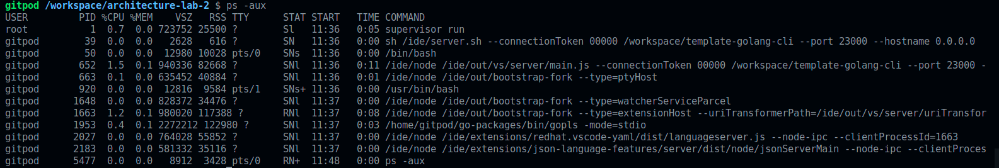
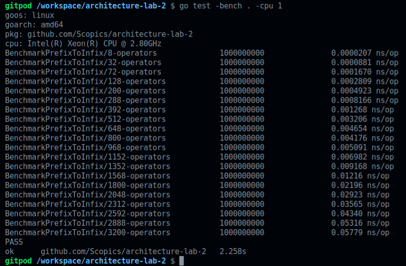
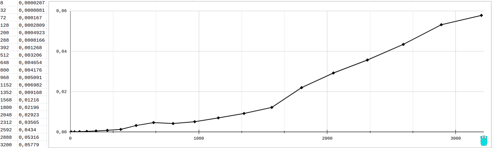
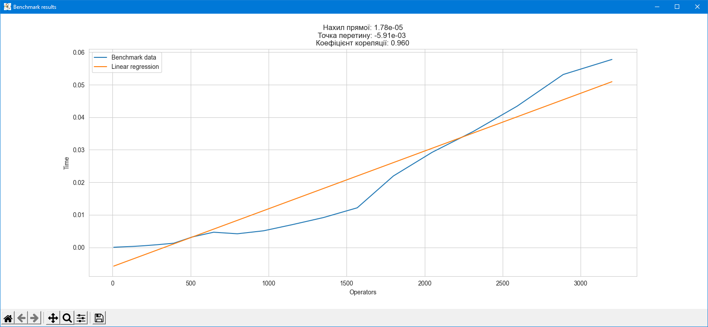
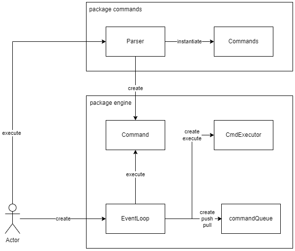

# Архітектура програмного забезпечення

## Розрахункова-графічна робота

#### Тема: Архітектурні діаграми та бенчмарки
#### Мета: Закріплення навичок ілюстрації організації програмних систем та оцінки часу виконання алгоритмів

### Завдання
1. Для 2-гої роботи, підтвердьте лінійний час виконання вашої функції перетворення
чи обчислення вхідного виразу.
2. Для 3-тої роботи, побудуйте діаграму взаємодії компонентів у вашій
імплементації.
3. Для 4-ої роботи, побудуйте діаграму взаємодії для вашої реалізації (на ній, скоріш за все, мають опинитися компоненти парсера, черги команд, ядра цикла) та підтвердьте лінійний час роботи вашого парсера команд.

## Хід виконання

### Завдання 1

Щоб довести лінійний час виконання функції перетворення вхідного виразу `PrefixToInfix` ми в файлі [implementation_test.go](https://github.com/Scopics/architecture-lab-2/blob/master/implementation_test.go) додаємо бенчмарк, де будемо запускати нашу функцію з аргументами різної довжини та робити заміри часу: 

```go
var res string

func BenchmarkPrefixToInfix(b *testing.B) {
	str := "- * / 15 - 7 + 1 1 3 + 2 + 1 + 9 "
	for i := 1; i <= 20; i++ {
		testStr := strings.Repeat(str, i*i) + "1"
		b.Run(fmt.Sprintf("%d-operators", i*i*8), func(b *testing.B) {
			res, _ = PrefixToInfix(testStr)
		})
	}
}
```

В цьому бенчмарку ми маємо заготовлений вираз, в якому не вистачає останнього операнда, ми його будемо потворювати n-ну кількість разів (у нашому випадку на `i²`) та в кінець дописувати у якості відсутнього останнього операнда одиницю, таким чином ми досягаємо різної кількості операторів на кожному кроці (і звичайно ж різну довжину аргумента), на першій ітерації операторів 8, на другій 32 і так далі, аж до 3200, для наших замірів даної вибірки буде достатньо. Також як можна помітити ми записуємо результат виконання функції в глобальну змінну `res`, це виконано для того, щоб уникати оптимізації компілятора, котрий може помітити, що результат чистої функції ніде не використовується і прибере її виклики.

Також було прийнято рішення, задля покращення і уточнення результатів бенчмаркінгу, проганяти бенчмарки не на персональних локальних машинах (адже тут купа процесів, що можуть вплинути на результат, наприклад запис якоїсь статистики ситеми тощо, під час замірів), а на віддаленому сервері, в ідеалі було б мати чистий арендований сервер і підключитись до нього за допомогою ssh, та налаштувати все власноруч, але ми скористаємось згенерованим мінмальним `workspace` для `golang cli` від `GitPod`. Нижче наведено список активних процесів:


Далі запускаємо команду `go test -bench . -cpu 1`, прапором `-bench` ми говоримо, що запускаємо саме бенчмарки, а `-cpu 1` що ми запускаємо бенчмарки тільки на 1 ядрі процесора. У результаті ми отримали:


Тепер перенесемо точки в `Google Tables` та побудуємо графік, реузльтат наведено нижче:



Як бачимо з графіку вище, всі точки не розташовуються рівно по лінії, це зумовлено тим, що хоч ми й запускали бенчмарк на машині з досить малою кількістю процесів, але все ж запуск відбувавсь не в ідеальних умовах (як бачимо зі списку процесів, є мережеві процеси і ще інші, тому цілком можливо що в момент запуску бенчмарку ми наприклад почати зчитувати дані з якогось сокету, тощо). Але можна сказати, аналізуючи результат графіку, що результат є наближеним до лінійного. Також було проведено аналіз даного графіку на наявність лінійної регресії, за допомогою мови програмування `python` та відповідних інструментів (сирцевий код наведено в додатку 1), результати аналізу наведено нижче:



По-перше ми бачимо, що наш графік наближається до, згенерованої інструментами аналізу даних, лінійної регресії, по-друге, за допомогою тих же інструментів геренації лінійної регресії, ми можемо отримати відповідних коіфіцієнт кореляції, що відповідає саме лінійній залежності, і як відомо, якщо він близький до 1, то скоріш за все залежність існує, в нашому випадку він приблизно рівний 0.96, отже можна стверржувати, що 
функція перетворення вхідного виразу `PrefixToInfix` є лінійною.

### Завдання 4

На наступному малюнку ми зобразили діаграму взаємодії для нашої програми:



На діаграмі ми можемо побачити взаємодію наступних компонентів:

#### Пакет main

- Пакет містить головну функцію, що розпочинає роботу `EventLoop`, сканує текстовий ввід та парсить його за допомогою `Parse()` і додає команди до `EventLoop` за допомогою `Post()`.

#### Пакет commands

Пакет включає в себе наступні компоненти:

- Метод `parse()` розбиває вхідний рядок на команду та її параметри, і повертає сформовану структуру типу `engine.Command`.

- Команди, що імплементують `engine.Command` і містять метод, що додає відповідну дію до event loop, що імплементує `Handler`.

#### Пакет engine

##### Компонент Command

- Компонент Command відповідає за певні дії, що можуть відбуватися за одну ітерацію event loop.
- Метод `Execute` відповідає за виконання самої дії. Він приймає Handler як аргумент

##### Компонент Handler

- Цей компонент дозволяє надсилати команди в пов'язаний event loop
- Метод `Post` існує для того, щоб додавати команду до черги виконання.

##### Компонент commandQueue

- Черга включає в себе `sync.Mutex` для забезпечення контролю доступу до спільного слайсу команд з різних рутин, він нам буде гарантувати, що між `Lock()` та `Unlock()` тільки одна рутина матиме доступ до ресурсу.

- Метод `pull()` реалізовано таким чином, що він спочатку викликає `Lock()`, потім перевіряє чи пустий слайс з командами, якщо це так, то встановлює `noCommand` в `true`, та викликає `Unlock()`, щоб далі чекати значення з каналу `pushed` у який, у разі додавання нової команди приходить сигнал. Як тільки ми дочекались знову викликається Lock() та береться елемент з слайсу. Така імплементація блокує цикл виконання `EventLoop` поки черга пуста, але вже хтось запустив цикл. В кінці завдяки defer, виконається `Unlock()`

- Метод `push()` також викликає `Lock()`, потім додає елемент в слайс і перевіряє, чи чекає хтось на новий елемент в слайсі, якщо це так, то відравляє у канал `pushed` сигнал.
В кінці завдяки defer, виконається `Unlock()`

- Метод `length()` просто повертає довжину слайса команд, але робить це безпечно завдяки використання `Mutex`. Він знадобиться при перевірці умови виходу з циклу подій.

##### Компонент cmdExecutor

- Це допоміжна внутрішня команда, що реазіує інтерфейс `Command`, яка знадобиться нам, щоб безпечно вставновлювати значення змінної про фініш циклу, адже ми читаємо прапор фінішу з іншої рутини, тоді як виставляти можемо з нашої основної. В даній стурктурі ми передаємо при ініціалізації функцію, котра викличеться в методі `Execute()`

##### Компонент EventLoop

- EventLoop займається асинхронним виконанням команд, які можна додати через метод `Post()`, який просто викличе `push()` на черзі команд. EventLoop імплементує інтерфейс `Handler`.

- При виклику `Start()` ми ініціалзізуємо чергу, та канал в який ми будемо посилати сигнал у разі коли цикл подій опрацював всі події та хтось чекає на завершення. Далі в іншій рутині запусається цикл котрий працює доти, доки черга не пуста та ніхто не чекає на завершення, в тілі циклу ми отримуємо команду за допомогою `pull()` (як говорилось вище він заблокує потік виконання, якщо команди немає), і дочекавшись з нього команду викликаємо на ній метод `Execute()`, якщо ми вийшли з циклу нам потрібно ще надіслати значення в канал, що ми закінчили і той хто нас чекає міг теж завершитись.

- І нарешті метод `AwaitFinish()` нам потрібен для того, щоб сказати циклу подій, що хтось чекає на те, щоб цикл завершивсь, але прапорець про завершення просто так не можна поставити в `true`, тому ми й користуємось спеціальною командою, яка описана вище. Опублікувавши команду, що встановить прапорець в значення, що хтось чекає фінішу, ми очікуємо значення з каналу, який сповістить нам що ми завершились та виходимо.

## Додатки
### Додаток 1
Сирцевий код аналізу лінійної регресії на `python`
```python
import pandas as pd
import matplotlib.pyplot as plt
import seaborn as sns
import scipy.stats as st
sns.set_style('whitegrid')

data = pd.read_csv("benchmark1.csv")
sns.lineplot(x=data["Operators"], y=data["Time"], label="Benchmark data")

lr = st.linregress(data.iloc[:, 0], data.iloc[:, 1])
line = data["Operators"] * lr.slope + lr.intercept
sns.lineplot(x=data["Operators"], y=line, label="Linear regression")

plt.title(f"Нахил прямої: {lr.slope:.5f}\nТочка перетину: {lr.intercept:.5f} \nКоефiцiєнт кореляцiї: {lr.rvalue:.5f}")
plt.ylabel("Time")
plt.xlabel("Operators")
plt.legend()
plt.get_current_fig_manager().set_window_title('Benchmark results')
plt.show()
```
